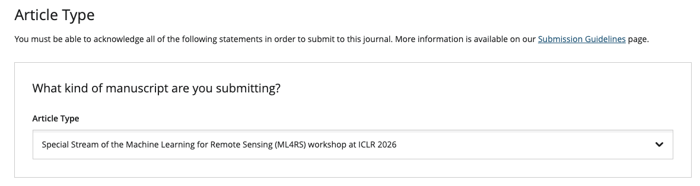

# Machine Learning for Remote Sensing

This workshop promotes trans-disciplinary research through diverse view-points to tackle the pressing questions of our times, such as climate change, social inequalities, biodiversity, and food security. Developing modern machine learning approaches tailored towards remote sensing data is key to investigating these problems efficiently. The special theme of our workshop this year is **“ML4RS: publication to practice”**. Our workshop this year will focus on bridging gaps between research and real-world applications while continuing to catalyze state-of-the-art research through discussion and feedback on early-stage research.

### Topics

By fostering collaborations between ML researchers and remote sensing domain experts, our workshop promises to break new ground in advancing both the methodologies and applications of ML for remote sensing, setting the stage for future advances in this field. Our workshop solicit contributions tackling problems including (but not limited to):

- 🧠 Foundation models: How can large models pretrained on unlabeled satellite data capture spectral, spatial, and temporal nuances to accelerate downstream tasks?
- ✍🏽 Active learning & annotation efficiency: How can we target limited labeling effort to maximize model performance?
- 🧩 Imperfect evaluation data: How can we assess model quality and detect artefacts with sparse or uncertain labels?
- 🔎 Interpretability & generalization: How can geospatial priors and physical models improve transparency and robustness?
- 📊 Benchmarking & impact: How can evaluation metrics reflect real-world impact and enable fair model comparison?
- 🪶 Accessibility & efficiency: How can we democratize ML4RS through distributed, low-cost training and experimentation?
- 🌎 Local vs. global models: Should we aim for one global model or many local specialists, and can we identify scopes for transfer automatically?
- 🪄 Precomputed embeddings: How can we best use precomputed embeddings from foundation models, instead of requiring users to compute embeddings themselves?

## 🗓 Schedule
Event times shown in the schedule are local times in Brazil. The workshop will be held in Room 212. 

| Time          | Topic                            |
|---------------|----------------------------------|
|9:00–9:15  | Opening Remarks                  |
|9:15–9:45  | Keynote 1: Gilberto Camara |
|9:45–10:00 | Invited Talk 1: Beth Tellman |
|10:00-10:15 | Invited Talk 2: Anthony Fuller |
|10:15-10:30 | Invited Talk 3: Antonio Belchior Anciaes Ferraz |
|10:30–11:00| Coffee Break                     |
|11:00-12:00| Discussion / Debate: “Foundation Models - Are we there yet?” (Morning keynote + invited speakers)|
|12:00-13:30| Lunch (opportunity to visit posters and have discussions) |
|13:30-14:00| Keynote 2: Dario Augusto Borges Oliveira |
|14:00-15:00| Contributed Spotlight Presentations  • 14:00–14:12 \| [FOCUS: A Noise-Aware Geospatial Learning Framework for PFAS Contamination Mapping](https://openreview.net/forum?id=zLMTU3U3ym), Jowaria Khan, Alexa Friedman, Sydney Evans, Rachel Klein, Runzi Wang, Katherine E. Manz, Kaley Beins, David Q. Andrews, Elizabeth Bondi-Kelly  • 14:12–14:24 \| [Bridging the "Predictability Desert": A Probabilistic Bias Correction Framework for AI and Dynamical Subseasonal Forecasts](https://openreview.net/forum?id=oqCTH31O88), Hannah Guan, Soukayna Mouatadid, Paulo Orenstein, Judah Cohen, Zekun Ni, Haiyu Dong, Genevieve Elaine Flaspohler, Alex Xijie Lu, Jonathan A. Weyn, Lester Mackey  • 14:24–14:36 \| [CERBERUS: A Three-Headed Decoder for Vertical Cloud Profiles](https://openreview.net/forum?id=3eQBmoPBkw), Emily Katherine de Jong, Kevin M. Smalley, Peter Martin Caldwell, Nipun Gunawardena, Hassan Beydoun  • 14:36–14:48 \| [Precipitation nowcasting of satellite data using physically-aligned neural networks](https://openreview.net/forum?id=qIka1ACAEF), Antônio Catão, Melvin Poveda, Leonardo Voltarelli, Paulo Orenstein  • 14:48–15:00 \| [Survey Protocol Cards for Crop Maps](https://openreview.net/forum?id=Fqms9xeRpD), Akram Zaytar, Girmaw Abebe Tadesse, Caleb Robinson, Gilles HACHEME, Inbal Becker-Reshef, Rahul M Dodhia, Juan M Lavista Ferres |
|15:00-16:00| Coffee Break and Poster Session |
|16:00-16:15| Industry perspectives (Earthdaily) |
|16:15-16:45| Tutorials Overviews & Office hours |
|16:45-17:00| Best Paper Awards + Closing Remarks |

### Tutorials and office hours links:
1. **Practical Embedding Workflows with Terratorch, the Geospatial Fine-tuning Toolkit** ([Terratorch Office Hours](https://teams.microsoft.com/meet/288313004934403?p=9kegftXHegWoY7s13k))
- [Tutorial codebase](https://github.com/terrastackai/terratorch/blob/main/examples/embeddings/README.md)
  - [Embedding Generation Python Notebook](https://github.com/terrastackai/terratorch/blob/main/examples/embeddings/embedding_generation_burnscars.ipynb)
  - [Embedding Generation Python Notebook](https://github.com/terrastackai/terratorch/blob/main/examples/embeddings/downstream_segmentation_burnscars.ipynb)
- [Terratorch explained (video)](https://youtu.be/LNKovSef5lU?si=cbbGWAAtda67VJW6)
2. **EarthEmbeddingExplorer: A Web Application for Cross-Modal Retrieval of Global Satellite Images** ([EarthEmbeddingExplorer Office hours](https://us05web.zoom.us/j/86138099950?pwd=OdBBtLpTZg7QpzEplZ9OQiMRZ7ejmF.1))
- [3 minute demo video](https://youtu.be/tHqa0knKeX0)
- [10 minute oral presentation](https://youtu.be/PvBO44PCVkA)
- Web applications: [web application 1](https://modelscope.cn/studios/Major-TOM/EarthEmbeddingExplorer), [web application 2](https://modelscope.ai/studios/Major-TOM/EarthEmbeddingExplorer)

3. **Cropland Mapping using Geospatial Embeddings** (no office hours)
- [Tutorial Video](https://youtu.be/5ra4zivbAfg) 
- [Tutorial Blogpost](https://nasaharvest.github.io/presto-embeddings)

4. 	**Advancing Earth Observation Through Machine Learning: A TorchGeo Tutorial** ([Torchgeo Office Hours](https://asu.zoom.us/my/davrob))
- [Tutorial code / colab notebook](https://torchgeo.readthedocs.io/en/latest/tutorials/earth_surface_water.html)
  
5. **Fields of The World: A Field Guide for Extracting Agricultural Field Boundaries** ([Fields of The World Office Hours](https://meet.google.com/bsm-eixf-cpn))
- [Tutorial codebase](https://github.com/fieldsoftheworld/iclr2026-ml4rs-tutorial)
  -   [agriculture monitoring python notebook](https://github.com/fieldsoftheworld/iclr2026-ml4rs-tutorial/blob/main/1.0-agriculture-monitoring-with-ftw.ipynb)
  -   [country-scale field boundary prediction notebook](https://github.com/fieldsoftheworld/iclr2026-ml4rs-tutorial/blob/main/2.0-country-scale-field-boundary-predictions.ipynb)

6. 	**Getting Started with OlmoEarth: From Embeddings to Fine-tuning** (In person office hours)
- [Tutorial Video](https://youtu.be/2x_7Cc4URxY)
- [Tutorial Github](https://github.com/allenai/olmoearth_ml4rs_tutorial)

### Oral Presentation Videos:
1. [FOCUS: A Noise-Aware Geospatial Learning Framework for PFAS Contamination Mapping](https://drive.google.com/file/d/1mp0RNrnsntDFyw4PI8vpwdFP72bdQ8Ba/view?usp=sharing). Jowaria Khan, Alexa Friedman, Sydney Evans, Rachel Klein, Runzi Wang, Katherine E. Manz, Kaley Beins, David Q. Andrews, Elizabeth Bondi-Kelly
2. [When Does Embedding Arithmetic Fail?](https://youtu.be/ZbpGPGeoBnY) Jinpyo Hong, Le Yu
3. [DiffuSAM: Diffusion Guided Zero-Shot Object Grounding for Remote Sensing Imagery](https://youtu.be/mPl55ig0UsE). Geet Sethi, Panav Shah, Ashutosh Gandhe, Soumitra Darshan Nayak
4. [When Less Is More: Simplicity Beats Complexity for Physics-Constrained InSAR Phase Unwrapping](https://drive.google.com/file/d/1wKgJmx6akYAY1wzTBEdGGwT1sTi1nFPf/view?usp=sharing). Prabhjot Singh, Manmeet Singh

## Call for Papers

### Important Dates
- Submission Deadline - February 6, 2026 (Anywhere on Earth)
- Acceptance Notification - March 1st, 2026
- Workshop - Monday April 27th, 2026
- GRSL Special Stream Submission Close - September 1st, 2026

### Submission Format

This year, we have three tracks:

1. a workshop paper track (4-pages)
2. a tiny paper track (2-pages)
3. a tutorials track (up to 4-pages)

#### Workshop paper track

We invite short papers (4 pages) describing new and ongoing/in progress research. To prepare your submission, please use the [LaTeX style files for the ML4RS workshop ICLR 2026](https://www.overleaf.com/read/qdchcvppbwvn#131dd7) that provides further detail on the paper structure. Paper reviews will be **double blind**. When submitting your manuscript, make sure you do not include any personally-identifying information such as author names or GitHub links which would de-anonymize the submission.

Page limits do not include references, which are unlimited. Papers may have an optional appendix which will not count toward the page limit. The workshop papers will be **non-archival** and dual submission is allowed where permitted by third parties. Authors of ICLR ML4RS papers can opt to have their 4-page submissions evaluated as GRSL candidates, following the journal’s review standards during the workshop (please note that this will incur a - fast - additional review phase and additional publication fees).

Machine Learning for Remote Sensing is non-archival and thus dual submission is allowed where permitted by third parties.

#### Tiny paper track

We welcome **tiny papers** (2 pages) that present focused contributions at the intersection of machine learning and remote sensing. Tiny papers may report modest but complete experimental results, introduce a fresh perspective with supporting evidence, offer a single theoretical insight, or propose new ideas and seek feedback from the community. In this track, we encourage participation from students and researchers who may be new to either remote sensing or machine learning.  While not required, we encourage examples or applications related to **Brazil**, aligned with ICLR 2026’s location; submissions without this connection will not be penalized. Page limits do not include references, which are unlimited. Appendices are not allowed for the tiny paper track.

#### Tutorials track

🆕 This year's workshop features a new Tutorials track, which aims to expedite the use of new models, code libraries, datasets, and benchmark challenges – facilitating their use in both practical applications and comprehensive benchmarking in future research studies. We invite short papers (up to 4 pages) detailing a tutorial for a model, code library, dataset, or other contribution. We expect most (but not necessarily all) tutorials will be accompanied by an executable Colab notebook, Jupyter notebook, or other code files that can be run on a laptop.
- Some tutorials may use the full 4 pages to describe or present their tutorial. This may be instead of, or accompanying, an executable Colab notebook or other code repository.
- We expect that some tutorials may be significantly less than 4 pages, particularly when accompanied by a detailed Colab notebook or Github repository.
- The OpenReview submission site accepts a single pdf, so you should include any links to notebooks or repositories in the pdf.
- The tutorial track is **single-blind**, so you do not need to anonymize your tutorial submission.

Accepted tutorial submissions will be invited to record a 15-minute video tutorial leading learners through their tutorial. All accepted tutorials will be posted publicly on our workshop website. Authors of highly reviewed tutorial submissions will be invited to give spotlight presentations and lead breakout "intensives" with extended interactive tutorials and Q&A during the workshop.

🇧🇷 We encourage tutorials with examples involving Brazil or other South American regions in their case studies, when feasible (for example, if the tutorial teaches users about a new, lightweight segmentation model for detecting tree crowns, the example in the tutorial notebook could focus on an area in Brazil). For some tutorials, such as existing benchmark datasets, this may not be feasible, and would not be counted against submissions during review.

### LLM usage
This workshop follows the [Policies on Large Language Model Usage at ICLR 2026](https://blog.iclr.cc/2025/08/26/policies-on-large-language-model-usage-at-iclr-2026/). Please note that ICLR policies explicitly state that AI-generated papers are not allowed for tiny nor short paper track.

### Paper Submission

Please submit your paper before the deadline (see important dates!) via OpenReview:

- **Workshop paper track**: [https://openreview.net/group?id=ICLR.cc/2026/Workshop/ML4RS_Main_Track](https://openreview.net/group?id=ICLR.cc/2026/Workshop/ML4RS_Main_Track)
- **Tiny paper track**: [https://openreview.net/group?id=ICLR.cc/2026/Workshop/ML4RS_Tiny_Track](https://openreview.net/group?id=ICLR.cc/2026/Workshop/ML4RS_Tiny_Track)
- **Tutorial track**: [https://openreview.net/group?id=ICLR.cc/2026/Workshop/ML4RS_Tutorial_Track](https://openreview.net/group?id=ICLR.cc/2026/Workshop/ML4RS_Tutorial_Track)

## Special ML4RS Stream at Geoscience and Remote Sensing Letters

This is an option for all accepted ML4RS papers that indicated interest in the GRSL special stream. All other papers and submissions will be desk-rejected.

- GRSL Special Stream Submission Open - May 1st, 2026
- GRSL Special Stream Submission Close - September 1st, 2026

Please submit your revised 4-page paper to the [IEEE Geoscience and Remote Sensing Letters](https://www.grss-ieee.org/publications/geoscience-and-remote-sensing-letters/) via the submission link: [https://ieee.submission.researchexchange.com/submission/dashboard?siteName=grsl](https://ieee.submission.researchexchange.com/submission/dashboard?siteName=grsl).

Please follow the [GRSL submission template](https://www.overleaf.com/latex/templates/ieee-geoscience-and-remote-sensing-letters-official-ieee-latex-template/zckwcmrxbvhg).

**Important:** In the submission portal under "Article Type", please specify the "Special Stream of the Machine Learning for Remote Sensing (ML4RS) workshop at ICLR 2026".

Your paper will be handled by the ML4RS organizers as Guest Editors, who will aim to assign the same reviewers as in the workshop to ensure a clean pathway to proceedings.

## Organizers

- [Esther Rolf](https://www.estherrolf.com/) (University of Colorado, Boulder)
- [Bianca Zadrozny](https://research.ibm.com/people/bianca-zadrozny) (IBM)
- [Hannah Kerner](https://hannah-rae.github.io/) (Arizona State University)
- [Marc Rußwurm](http://marcrusswurm.com/) (University of Bonn)
- [Evan Shelhamer](http://imaginarynumber.net/research/) (University of British Columbia)
- [Gabriel Tseng](https://gabrieltseng.github.io/) (Ai2)
- [Ronny Hänsch](http://www.rhaensch.de/) (German Aerospace Center (DLR) / GRSS)
- [Hamed Alemohammad](https://hamedalemo.github.io/) (Clark University)
